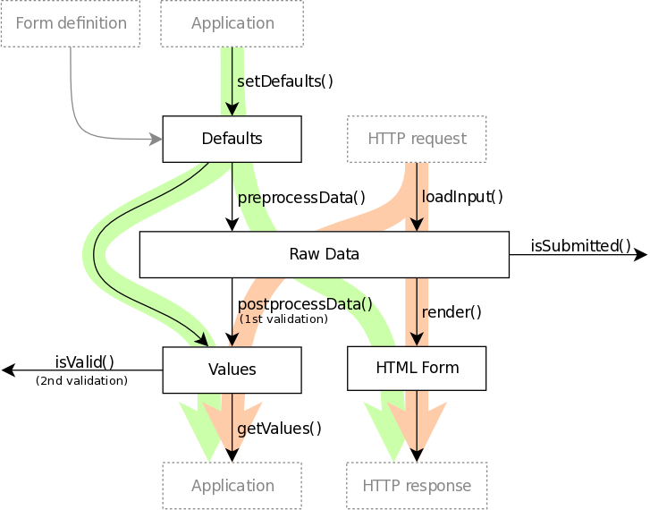

DUF: Declarative Ugly Forms
============================

DUF is a library for creating HTML5 forms and views. Everything in DUF is
designed to be declarative, so it is easy to connect your forms and views with
visual editor, store them in database or generate them from model metadata.

Data Flow
---------

There are two possible scenarios (see figure below):

  1. Form is displayed for the first time (green arrow).
  2. Form has been submitted (red arrow).

The `preprocessData()` and `postprocessData()` methods are inverse functions
converting data between internal representation and form values. So the
Defaults and the Values are of the same structure.

Form definition
---------------

Form definition contains set of fields and layout in which are these fields
arranged. Fields are specified in groups, where each group should represent one
entity. Form layout and field groups are completely unrelated.

Field group may be generated from field source (see
[IFieldSource](@ref Duf::FieldSource::IFieldSource)). If field group have
`field_source` option specified, given field source will be asked to generate
`fields` section of the field group configuration. Field sources are defined in
the [Toolbox](@ref Duf::Toolbox).

Both layouts and fields are of given type. When field or layout is used
specification of its type is looked up in a toolbox (see next section).

The fields can contain scalar value, array or object. To display the field the
list of named renderers is used. In typical simple case there are two renderers
per field -- one for label and other for input. The layout uses these renderes
to render coresponding field. Name of the renderer can be used by layout to
place it at right place (i.e. labels are often placed in predefined position).
Order of the renderers is usualy preserved by layout.

Form anatomy
------------

Fields in a form are not objects. They are represented only by configuration
and the form iterates over this configuration during validation and rendering.
This way it is easier to put various renderers and validators together. Also
there is no overhed with per-field object instantiation.

If there is complex hierarchy of field types in your application, the toolbox
configuration should be pre-generated from more elegant configuration files.
The configuration used by DUF is designed for effective form processing, not to
be user-friendly. Users (programmers) are expected to use specialized
generators to create field description from model metadata and visual editors
to draw forms.

Toolbox
-------

When the form needs to render something or process some data, it asks the
[Toolbox](@ref Duf::Toolbox) to do it. But toolbox is lazy and only looks into its
configuration and returns requested helper. So the toolbox is a service locator
object. It is similar to proxy, but Toolbox does not invoke anything, only
returns callables.

License
-------

The most of the code is published under Apache 2.0 license. See
[LICENSE](doc/license.md) file for details.

Contribution guidelines
-----------------------

There is no bug tracker yet, so send me an e-mail and we will figure it out.

If you wish to send me a patch, please create a Git pull request or send a Git
formatted patch via email.

